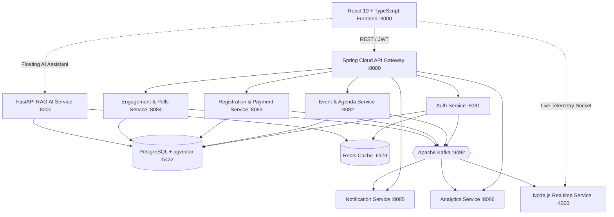

# Event Sphere — Full-Stack Event Management & Engagement Platform

[](https://github.com/eventsphere/event-sphere)
[](https://github.com/eventsphere/event-sphere)
[](https://github.com/eventsphere/event-sphere)
[](https://opensource.org/licenses/MIT)

> **"Connect. Engage. Experience."**  
> Event Sphere is a full-stack, enterprise-grade event management and live engagement SaaS ecosystem. Built for modern hybrid, in-person, and virtual summits, it combines high-throughput Spring Boot microservices, Kafka event streaming, and **Sphere AI** (pgvector RAG intelligence).

---

## 1. Key Features

- **🌐 Multi-Tenant Organization Management**: Isolate organizations, team permissions, branding, multiple hosted summits, and revenue analytics.
- **🪄 12-Step Event Creation Wizard**: Stepper guiding organizers through basic info, schedule, venue, branding, ticket tiers, agenda, speakers, sponsors, custom registration fields, notification triggers, and live publishing.
- **🤖 Sphere AI (RAG Assistant)**: Floating conversational assistant powered by FastAPI and PostgreSQL `pgvector`. Provides instant answers on schedule times, speaker research, venue logistics, and document summarization.
- **⚡ Real-Time Live Engagement**: Sub-second live audience polls, keynote Q&A queues with upvoting, interactive quizzes, session reaction bursts, and stage highlighting.
- **🤝 AI Networking Matchmaker**: Semantic compatibility scoring (e.g., 98% match) based on skills and interests, connection management, and direct messaging.
- **🎟️ Smart Ticketing & Digital Pass Wallet**: Multi-tier pass selector (Virtual, Standard, VIP), promo code discount validation (`SPHERE20`), payment abstraction layer, and printable NFC/QR conference badges.
- **📱 QR Scanner & Check-In Telemetry**: Live check-in scanner simulation, real-time gate occupancy rates, and CSV attendee export.
- **🏆 Gamification & XP System**: Reward attendees with points and badges for poll votes, questions asked, sessions bookmarked, and networking connections.
- **📊 Real-Time Analytics & KPIs**: Interactive Recharts dashboards for organizers and platform admins (revenue velocity, room occupancy, conversion rates, and NPS scores).

---

## 2. Technology Stack

| Layer | Technologies |
|---|---|
| **Frontend** | React 19, TypeScript, Vite, Tailwind CSS, Lucide Icons, Recharts, Canvas Confetti, Axios |
| **Backend Microservices** | Java 21, Spring Boot 3, Spring Cloud Gateway, Spring Security, Spring Data JPA, Kafka |
| **AI Backend** | Python 3.11, FastAPI, Pydantic, PostgreSQL `pgvector`, Semantic RAG Embeddings |
| **Realtime Service** | Node.js, Express, WebSockets |
| **Primary Database** | PostgreSQL 16 with `pgvector`, `uuid-ossp`, and `pgcrypto` |
| **Document Store** | MongoDB 7.0 (Chat messages, AI conversation history, audit activity) |
| **Caching & OTP** | Redis 7.2 |
| **Event Streaming** | Apache Kafka 7.6 with Zookeeper |
| **Containerization** | Docker, Docker Compose, Multi-Stage Builds |

---

## 3. Microservices Architecture



---

## 4. Quickstart Guide

### Option A: Complete Docker Compose (One-Click)

Make sure Docker and Docker Compose are installed:

```bash
# Clone the repository
git clone https://github.com/eventsphere/event-sphere.git
cd event-sphere

# Copy environment variables
cp .env.example .env

# Start all microservices, databases, AI engine, and frontend
docker-compose up --build
```

Access the services:
- **Frontend Web App**: [http://localhost:3000](http://localhost:3000)
- **API Gateway**: [http://localhost:8080](http://localhost:8080)
- **FastAPI AI Docs**: [http://localhost:8000/docs](http://localhost:8000/docs)
- **Node.js WebSocket Telemetry**: [http://localhost:4000](http://localhost:4000)

---

### Option B: Local Frontend Development

To run the React frontend locally with pre-configured mock data and active API bridge:

```bash
cd frontend
npm install
npm run dev
```

Open [http://localhost:3000](http://localhost:3000) in your browser.

---

## 5. Demo Credentials & Personas

Event Sphere includes a **Live Persona Switcher** directly in the top navigation bar to test all user roles with 1-click:

| Role | Demo Email | Password | Responsibilities |
|---|---|---|---|
| **ORGANIZER** | `organizer@techcorp.io` | `Password123!` | 12-Step wizard, ticket sales, live Q&A moderation, analytics |
| **ATTENDEE** | `attendee@nexus.io` | `Password123!` | Discovery, ticket checkout (`SPHERE20`), digital badges, agenda |
| **ADMIN** | `admin@eventsphere.io` | `Password123!` | Platform health, tenant organizations, audit logs |
| **SPEAKER** | `speaker@synthetix.ai` | `Password123!` | Assigned stage sessions, attendee questions, slides |
| **SPONSOR** | `sponsor@hypercloud.com` | `Password123!` | Booth #101 stats, lead capture, tier analytics |

---

## 6. API Route Reference

### Auth Service (`:8081`)
- `POST /api/auth/register` — Register a new user with BCrypt password hashing
- `POST /api/auth/login` — Authenticate and receive JWT access & refresh tokens
- `GET /api/auth/health` — Service health check

### Event Service (`:8082`)
- `GET /api/events` — List published summits with category and format filters
- `POST /api/events` — Create and publish an event
- `GET /api/events/{slug}` — Retrieve event details with agenda, speakers, and sponsors

### AI & RAG Service (`:8000`)
- `POST /api/ai/chat` — Conversational query to Sphere AI with pgvector semantic retrieval
- `POST /api/ai/recommendations` — Compute personalized attendee and session compatibility
- `POST /api/ai/documents/ingest` — Ingest, chunk, and embed event documents

### Registration Service (`:8083`)
- `POST /api/registrations/checkout` — Purchase tickets and issue encrypted QR pass tokens
- `POST /api/checkin/validate` — Validate QR tokens at conference entrance

---

## 7. License

Distributed under the MIT License. See `LICENSE` for more information.
