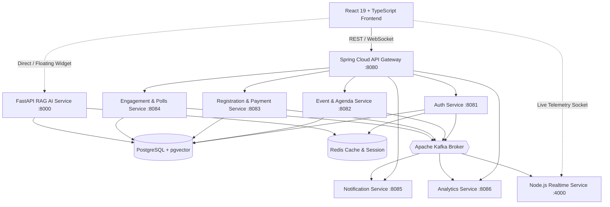

# Event Sphere — Architecture Specification

## 1. System Architecture Diagram

## 2. Microservice Port Allocation
| Service | Technology | Port | Responsibilities |
|---|---|---|---|
| **Frontend** | React 19, Vite, Tailwind CSS | `:3000` | SaaS Web Application UI, Dashboards, Pass Wallet |
| **API Gateway** | Spring Cloud Gateway | `:8080` | Unified routing, SSL termination, JWT verification |
| **Auth Service** | Spring Boot, Spring Security | `:8081` | User registration, login, BCrypt hashing, JWT tokens |
| **Event Service** | Spring Boot, Spring Data JPA | `:8082` | Multi-tenant event management, sessions, speakers |
| **Registration Service** | Spring Boot, Spring Data JPA | `:8083` | Ticket purchasing, QR generation, check-in validation |
| **Engagement Service** | Spring Boot, Kafka | `:8084` | Live polls, stage Q&A upvotes, surveys, quizzes |
| **Notification Service**| Spring Boot, Kafka | `:8085` | Asynchronous email dispatch, SMS, OTP triggers |
| **Analytics Service** | Spring Boot, Kafka | `:8086` | Real-time attendee KPI aggregations, revenue velocity |
| **AI & RAG Service** | Python, FastAPI, pgvector | `:8000` | Sphere AI Assistant, vector embeddings, matchmaking |
| **Realtime Service** | Node.js, Express, WebSockets | `:4000` | Low-latency live stage poll & Q&A broadcast |
| **PostgreSQL** | PostgreSQL 16 + pgvector | `:5432` | Primary ACID relational & vector database |
| **MongoDB** | MongoDB 7.0 | `:27017`| Dynamic document storage, conversation history |
| **Redis** | Redis 7.2 | `:6379` | Token caching, rate limiting, temporary state |
| **Kafka** | Apache Kafka 7.6 | `:9092` | Asynchronous event streaming bus |
